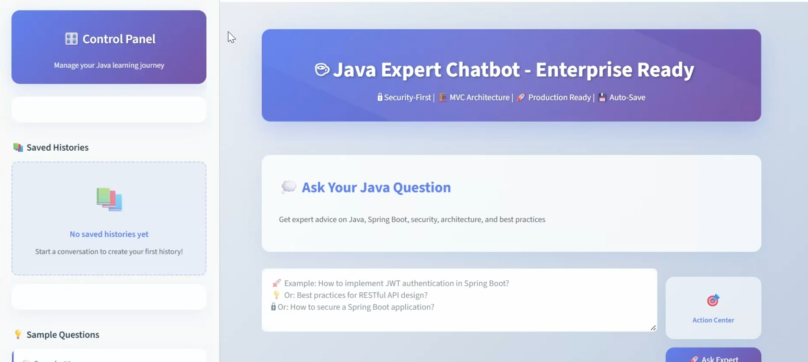

# ☕ Java Expert Chatbot - Enterprise Ready

A sophisticated, AI-powered Java and Spring Boot learning assistant that provides enterprise-grade, security-focused solutions with modern MVC architecture compliance.


## 🎥 Demo Video

Experience the Java Expert Chatbot in action:

[](demo/java-expert-chatbot-demo.mp4)

**[▶️ Watch Demo Video](demo/java-expert-chatbot-demo.mp4)**

> *Click the thumbnail above or the link to view the demo video*

**What you'll see:**
- 🚀 Real-time AI responses with streaming
- 💼 Enterprise-grade code generation
- 🔒 Security-focused Java solutions
- 🎨 Modern UI with glass morphism design
- 💾 Auto-save and history management
- 📋 One-click code copying

---

## 🌟 Features

### 🔒 **Security-First Approach**
- ✅ Input validation with Bean Validation
- ✅ SQL injection prevention techniques
- ✅ JWT authentication implementation
- ✅ BCrypt password hashing examples
- ✅ CSRF protection guidelines
- ✅ Secure coding best practices

### 🏗️ **Enterprise Architecture**
- ✅ Complete MVC architecture compliance
- ✅ SOLID principles implementation
- ✅ MapStruct for DTO mapping
- ✅ Structured error response handling
- ✅ Audit trail implementation
- ✅ Production-ready code examples

### 🤖 **AI-Powered Intelligence**
- ✅ Real-time streaming responses
- ✅ Context-aware conversations
- ✅ Java/Spring Boot domain expertise
- ✅ Code example generation
- ✅ Best practices recommendations
- ✅ Common pitfall identification

### 🎨 **Modern User Interface**
- ✅ Glass morphism design
- ✅ Responsive layout
- ✅ Auto-save functionality
- ✅ Chat history management
- ✅ Code syntax highlighting
- ✅ One-click code copying

### 📚 **Comprehensive Learning**
- ✅ Step-by-step explanations
- ✅ Testing examples (JUnit, MockMvc)
- ✅ Performance optimization tips
- ✅ Related concept suggestions
- ✅ Sample question library

---

## 🚀 Quick Start

### Prerequisites
- Python 3.8 or higher
- Groq API key ([Get one here](https://console.groq.com/))

### Installation

1. **Clone the repository**
   ```bash
   git clone https://github.com/Gr-een-arrow/Java-Expert-Chatbot.git
   cd Java-Expert-Chatbot
   ```

2. **Create virtual environment**
   ```bash
   python -m venv venv
   # Windows
   venv\Scripts\activate
   # macOS/Linux
   source venv/bin/activate
   ```

3. **Install dependencies**
   ```bash
   pip install -r requirements.txt
   ```

4. **Configure environment**
   ```bash
   # Copy the example environment file
   cp .env.example .env
   
   # Edit .env and add your Groq API key
   GROQ_API_KEY=your_actual_api_key_here
   ```

5. **Run the application**
   ```bash
   streamlit run run_app.py
   ```

6. **Access the application**
   - Open your browser to `http://localhost:8501`
   - Start asking Java and Spring Boot questions!

---

## 📁 Project Structure

```
Java-Expert-Chatbot/
├── � src/                    # Organized source code
│   ├── 📄 main.py             # Main application entry point
│   ├── 📁 ui/                 # User interface components
│   │   ├── styles.py          # CSS styling and themes
│   │   ├── components.py      # Reusable UI components
│   │   ├── sidebar.py         # Sidebar functionality
│   │   └── chat_interface.py  # Main chat interface
│   ├── � core/               # Core business logic
│   │   └── chat.py            # AI chat engine
│   └── � utils/              # Utilities and configuration
│       ├── config.py          # Application configuration
│       └── chat_utils.py      # Chat utility functions
├── � demo/                   # Demo video and assets
│   ├── java-expert-chatbot-demo.mp4  # Main demo video
│   └── thumbnail.png          # Video thumbnail (optional)
├── � app.py                  # Legacy entry point
├── 📄 run_app.py              # Alternative entry point
├── 📄 requirements.txt        # Python dependencies
├── 🔧 .env.example            # Environment variables template
└── 📁 .streamlit/             # Streamlit configuration
    └── config.toml            # UI theme settings
```

### Key Files Explained

- **`src/main.py`** - Main application entry point with organized imports
- **`src/ui/`** - User interface components including styles, sidebar, and chat interface
- **`src/core/chat.py`** - AI chat engine with Groq API integration and response processing
- **`src/utils/`** - Configuration and utility functions for chat operations
- **`demo/`** - Demo video showcasing the chatbot's capabilities
- **`tests/`** - Test suite for verifying the organized structure
- **`docs/`** - Architecture documentation with system diagrams
- **`chat_history/`** - Auto-saved conversation histories in JSON format
- **`.streamlit/config.toml`** - UI theme configuration for consistent branding

---

## 🛠 Technology Stack

### **Backend & AI**
-  **Python 3.8+** - Core programming language
-  **Streamlit** - Web application framework
-  **Groq API** - Large Language Model integration
-  **Requests** - HTTP client for API communication

### **Frontend & UI**
-  **HTML5** - Semantic markup
-  **CSS3** - Advanced styling with glass morphism
-  **JavaScript** - Clipboard API integration
-  **Responsive Design** - Mobile-friendly interface

### **Development Tools**
-  **Git** - Version control
-  **python-dotenv** - Environment variable management
-  **JSON** - Data serialization and chat history storage

---

## 🎯 Usage Examples

### Basic Query
```
User: "How to implement JWT authentication in Spring Boot?"

Response: Complete enterprise-grade solution including:
- Security configuration
- JWT filter implementation
- Token validation
- Error handling
- Testing examples
```

### Advanced Architecture Questions
```
User: "Best practices for Spring Boot microservices?"

Response: Comprehensive guide covering:
- Service decomposition strategies
- Inter-service communication
- Configuration management
- Security patterns
- Monitoring and logging
```

---

## ⚙️ Configuration

### Environment Variables
Create a `.env` file in the project root:

```env
# Required: Groq API Configuration
GROQ_API_KEY=your_groq_api_key_here

# Optional: Application Settings
MAX_CONVERSATION_HISTORY=20
RESPONSE_TIMEOUT=90
ENABLE_DEBUG_LOGGING=false
```

### Streamlit Configuration
The `.streamlit/config.toml` file contains UI theme settings:

```toml
[theme]
backgroundColor = "#FFFFFF"
primaryColor = "#4A90E2"
secondaryBackgroundColor = "#F8F9FA"
textColor = "#2C3E50"
font = "sans serif"
```

---

## 🧪 Features in Detail

### 🔄 **Real-time Streaming**
- Live response generation as you type
- Visual progress indicators
- Instant feedback with modern animations

### 💾 **Auto-Save Functionality**
- Automatic conversation history saving
- Custom naming for saved chats
- Easy history management and retrieval

### 📝 **Code Generation**
- Complete, runnable code examples
- Enterprise package structure
- Security-compliant implementations
- MapStruct mapping examples
- Comprehensive testing code

### 🎨 **Modern UI Design**
- Glass morphism effects with backdrop blur
- Responsive design for all devices
- CSS animations and transitions
- Dark/light theme support
- Accessibility features

---

## Custom Configuration
You can modify the chatbot's behavior by editing the system prompts in `chat.py`:

```python
# Customize the AI's expertise focus
enhanced_system_prompt = """
Your custom system prompt here...
"""
```

---


## 🆘 Troubleshooting

### Common Issues

**API Key Not Found:**
```bash
# Ensure your .env file exists and contains:
GROQ_API_KEY=your_actual_key_here
```

**Dependencies Issues:**
```bash
# Reinstall dependencies
pip install --upgrade -r requirements.txt
```

**Port Already in Use:**
```bash
# Run on different port
streamlit run app.py --server.port 8502
```
